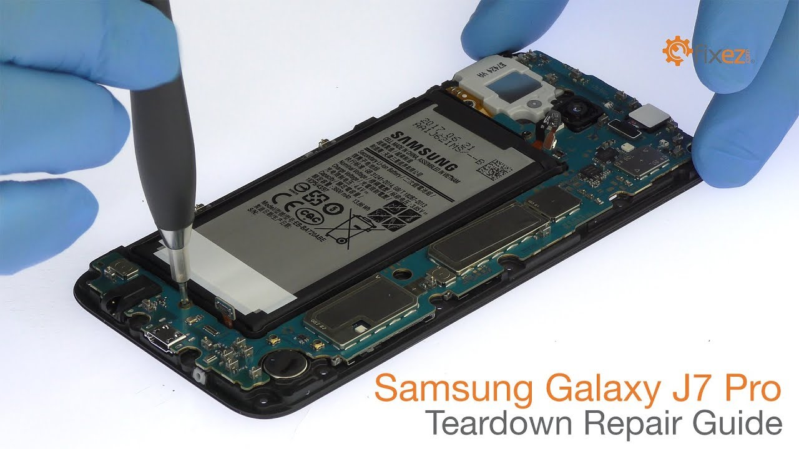
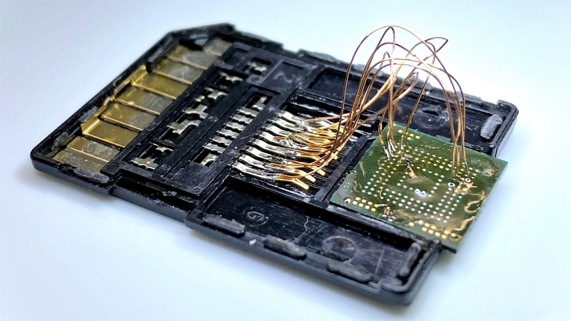
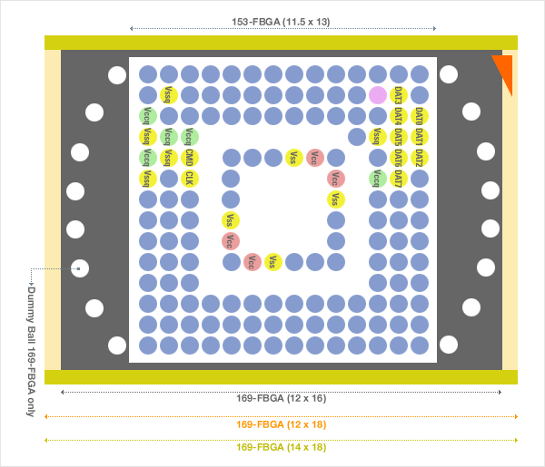
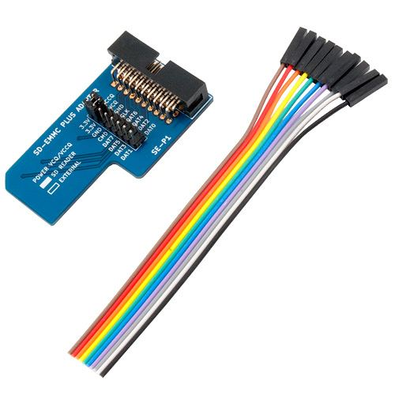
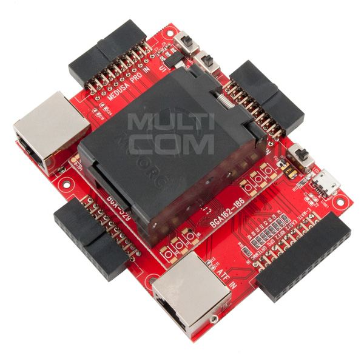
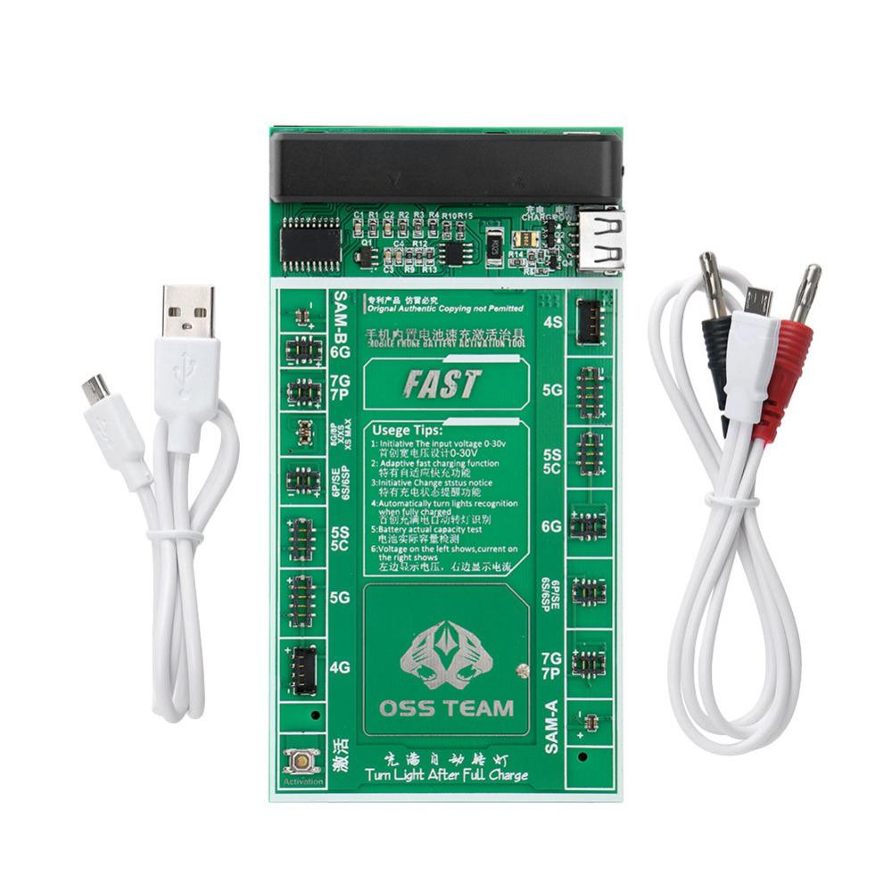
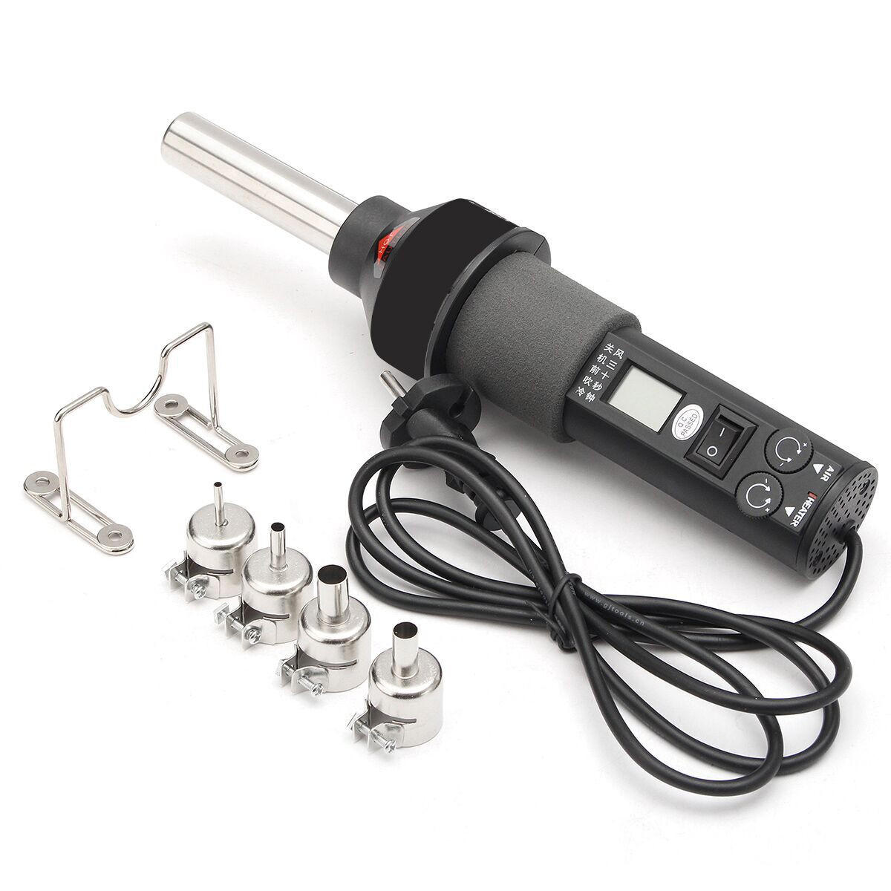

# Repair-Mobile-Phone
This repo contains the links which can be helpful in finding faults in motherboard of Samsung Galaxy J7Pro or Can help in recovering data using the emmc chip.  

Four days back (16 June 2020 - In the period of Lockdown due to Corona Virus), my phone automatically got fucked up. I slept at around 3:00 am with 6% battery in my Samsung Galaxy J7 Pro (awesome camera, much data - my camscanner data, some important photos (includes images of someone special), some passwords, notes, etc., some backed up and some not, and a broken AMOLED screen). When I woke up at around 12:00 pm in the morning, it was no shock to me that my cell phone is not starting, since the battery may have been drained out. I put my phone up on charging and got busy doing some early morning (afternoon) stuff. After 5 minutes (can't do much without checking WhatsApp messages :p), I checked my phone and it was not turning on. I tried all changing of chargers, checking charger, etc. but all in vain. 
So now today, all my efforts to get my phone running up again, turned to vain. The mobile mechanic told that some part of the motherboard is shortcircuited (In three days, he could find out this only) and either I need to take it to the Service center for a new change of mother board (which would cost me around 6-7k INR and 4.5k for the new AMOLED display change) or keep it with him for few days so that he could look for an alternative (maybe by replacing few parts on the MB or changing some capacitors). So my choice was to not to choose from any of these options and bring back my phone, and ask my parents to contribute some amount for my new phone.  
Till the time I can make my parents ready for a new phone. I found a little bit of stuff that I could try myself (if I could get the required components) to repair the phone/recover the data or would definitely try sometime (motive of making this repo).    

**So these are few sources where I will try to look upon:**  
1. **J7Pro Teardown** - [https://www.youtube.com/watch?v=uIONMLkpyuw](https://www.youtube.com/watch?v=uIONMLkpyuw)
2. Checking Shortcircuit in J7 Pro - [https://www.youtube.com/watch?v=qmQ4edbEH0U](https://www.youtube.com/watch?v=qmQ4edbEH0U)
3. **Data Recovery From a Damaged Smart Phone** - [https://dangerouspayload.com/2018/10/24/emmc-data-recovery-from-damaged-smartphone/](https://dangerouspayload.com/2018/10/24/emmc-data-recovery-from-damaged-smartphone/)
4. Repair of dead phone - [https://www.youtube.com/watch?v=J1l7mLKqkNk](https://www.youtube.com/watch?v=J1l7mLKqkNk)
5. Maybe this is repair of Power Management IC - [https://www.youtube.com/watch?v=6xWLDzQti9A](https://www.youtube.com/watch?v=6xWLDzQti9A)
6. Item for Cleaning PCB in 2nd comment - [https://www.youtube.com/watch?v=kbQaTqwh26A](https://www.youtube.com/watch?v=kbQaTqwh26A)
7. j7 pro model emmc pinout - [https://drive.google.com/file/d/10WVGF99M5dkRziGaCcKC3fqkcgW72xUL/view](https://drive.google.com/file/d/10WVGF99M5dkRziGaCcKC3fqkcgW72xUL/view)
8. Tool for boot repair emmc - [https://www.youtube.com/watch?v=CR4_En4A1FY](https://www.youtube.com/watch?v=CR4_En4A1FY)
9. mobile engineer (a general channel for repair videos) - [https://www.youtube.com/watch?v=yoPrpVw8mE4](https://www.youtube.com/watch?v=yoPrpVw8mE4)
10. What is EMMC chip? - eMMC is intended for use in portable devices as main storage meaning that an eMMC chip is neither removable nor swappable. Think of eMMC as an MMC card soldered to the motherboard of a smartphone
11. **Removing and Reading emmc chip** - [https://www.youtube.com/watch?v=peNdpZ3NUsE](https://www.youtube.com/watch?v=peNdpZ3NUsE)
12. Udemy course on mobile repair - [course url](https://www.udemy.com/course/cell-phone-repair-samsung-captivate-infuse-skyrocket/?gclid=CjwKCAjwxLH3BRApEiwAqX9arQv8MsHe8kl0-42wyrN-0iTtpaO4wUqHVH6EyFsCDDkm-kL7M7gdzBoC9koQAvD_BwE&matchtype=e&utm_campaign=LongTail_la.EN_cc.INDIA&utm_content=deal4584&utm_medium=udemyads&utm_source=adwords&utm_term=_._ag_80573525473_._ad_387397585801_._kw_cell+phone+repair+class_._de_c_._dm__._pl__._ti_kwd-824631651298_._li_1007823_._pd__._)
13. emmc connector using card reader - [https://320volt.com/en/32-gb-emmc-bellege-sd-kart-baglantisi/](https://320volt.com/en/32-gb-emmc-bellege-sd-kart-baglantisi/)
14. **Board Repair and Training Courses** - [iPadRehab  - Mobile Devices Repair Training](https://www.ipadrehab.com/index.cfm?Page=Practical-Board-Repair-School)
15. **Recover data Samsung Galaxy directly from phone memory** - [https://www.youtube.com/watch?v=nXDUhhyY2rE](https://www.youtube.com/watch?v=nXDUhhyY2rE)    

**EMMC Chip Pinout**:    
    

**EMMC Chip connectors and Readers**:    
  
Link to SSD EMMC Plus Adaptor - [sd-emmc-plus-adapter](https://multi-com.eu/,details,id_pr,21681,key,sd-emmc-plus-adapter-model-se-p1,smenu,gsm.html)
   

Link to E-Mate Pro eMMC Tool MoorC v3 - [e-mate-pro-emmc-tool-moorc-v3](https://multi-com.eu/,details,id_pr,21886,key,e-mate-pro-emmc-tool-moorc-v3,smenu,gsm.html)  

**EMMC Chip Readers**: 
1. https://www.aliexpress.com/item/32818557876.html?spm=a2g0o.productlist.0.0.63a24fb2F5m84e&algo_pvid=8329e97f-56ac-4697-926a-6eba480620e9&algo_expid=8329e97f-56ac-4697-926a-6eba480620e9-6&btsid=0ab6d67915925937483167006e0b7a&ws_ab_test=searchweb0_0,searchweb201602_,searchweb201603_
2. https://www.aliexpress.com/w/wholesale-emmc%20chip%20reader.html
3. https://www.dolphindatalab.com/product/dfl-emmc-chip-reader-all-in-one/    

**Items Required (that I dont have already)**:  
1. OSS TEAM - Battery Charger

2. Hot Air Solder

3. EMMC Chip Reader
